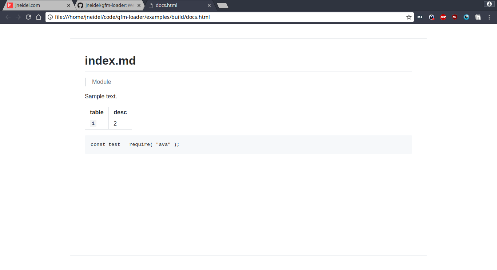

# gfm-loader

> Webpack loader to apply gfm styles to html transformed via markdown-loader

[](https://github.com/jneidel/gfm-loader/blob/master/license)
[](https://www.npmjs.com/package/gfm-loader)

Webpack loader to wrap markdown which has been been transformed to html in a `<body>` tag and apply gfm (github flavored markdown) styles.

## Install

[](https://www.npmjs.com/package/gfm-loader)

```
$ npm install gfm-loader
```

## Usage

In webpack config (read loaders from bottom to top):

```js
{
  rules: [
    {
      test: /\.md$/,
      use : [
        `file-loader?name=<output-path>`, // Save to given path
        `gfm-loader`, // Wrap html in body, apply gfm styles
        "extract-loader", // Extract html
        "html-loader", // Load html
        "markdown-loader", // Transfrom md -> html
      ]
    }
  ]
}
```

## Example

**See: [`examples/webpack.config.js`](examples/webpack.config.js)**

Rendered example (with `border=true`):



## API

### gfm-loader[?gfm=<path>&style=<path>&js=<path>&border=true]

**gfm:**

<table><tr>
  <td>Default: <code>https://cdnjs.cloudflare.com/ajax/libs/github-markdown-css/2.10.0/github-markdown.min.css</code></td>
</tr></table>

`href` for the gfm stylesheet.

```js
`gfm-loader?gfm=build/css/gfm.css`
```

**style:**

`href` for an additional stylsheet.
To customize gfm styles.

```js
`gfm-loader?gfm=build/css/gfm.css&style=build/css/bundle.css`
```

**js:**
`src` for an additional script file for customization.

```js
`gfm-loader?js=build/js/bundle.js`
```

**border:**

Include styles for a Github style border around the body.
See example image above.

```js
`gfm-loader?gfm=build/css/gfm.css&style=build/css/bundle.css&border=true`
```

## Changelog

**2.0.0:**

- Rename parameter `href` to `gfm`
- Add parameters `style` and `border`

## Related

- [setup-webpack](https://github.com/jneidel/setup-webpack) - Simplifies eg. markdown transpilation; the module this loader was built for

## License

MIT © [Jonathan Neidel](https://jneidel.com)
